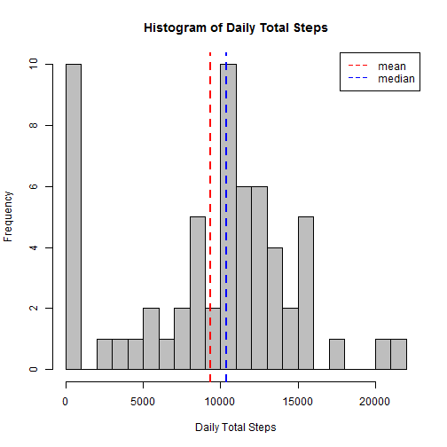
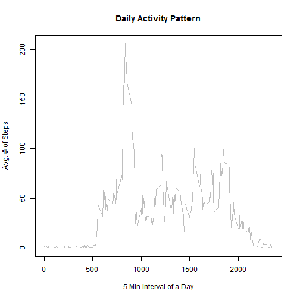
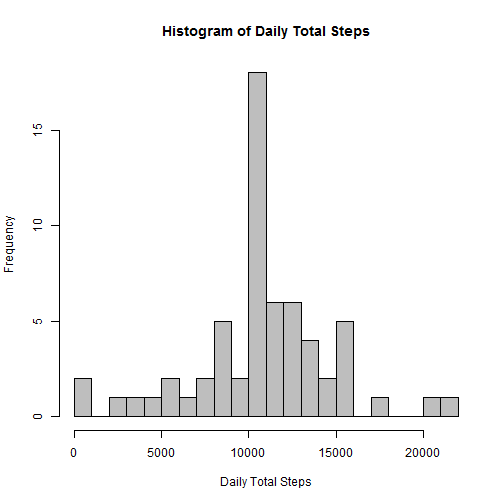
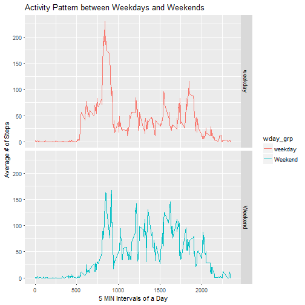

## Loading and preprocessing the data
Load the data provided. There are 3 variables 

```r
data <- read.csv(".\\activity\\activity.csv", header = T, na.strings = "NA", 
                 colClasses = c("numeric", "Date", "integer"))
str(data)
```

```
## 'data.frame':	17568 obs. of  3 variables:
##  $ steps   : num  NA NA NA NA NA NA NA NA NA NA ...
##  $ date    : Date, format: "2012-10-01" "2012-10-01" ...
##  $ interval: int  0 5 10 15 20 25 30 35 40 45 ...
```

Since we are unable to process the "date" at the minutes level, we create another variable "mydate" to reprent timestamp.

```r
library(lubridate)
mytime <- paste(data$interval %/% 100, data$interval %% 100, "00", sep = ":")
data$mydate <- ymd_hms(paste(data$date, mytime))
head(data, 3)
```

```
##   steps       date interval              mydate
## 1    NA 2012-10-01        0 2012-10-01 00:00:00
## 2    NA 2012-10-01        5 2012-10-01 00:05:00
## 3    NA 2012-10-01       10 2012-10-01 00:10:00
```


## What is mean total number of steps taken per day?
1. Calculate the total number of steps taken per day


```r
library(dplyr)
by_day <- data %>% group_by(date) %>% 
    summarise(day_steps = sum(steps, na.rm = T))
```

2. use Summary() function to Calculate and report the mean and median of the total number of steps taken per day.


```r
summary(by_day$day_steps)
```

```
##    Min. 1st Qu.  Median    Mean 3rd Qu.    Max. 
##       0    6778   10400    9354   12810   21190
```

Median 10,400 is greater than Mean 9,354, which is lightly right scewed.

3. Make a histogram of the total number of steps taken each day. We set the bin to 20 instead of default 5 to see a little bit more detail of the distribution.


```r
hist(by_day$day_steps, breaks = 20, col = "gray", cex = 0.8, 
     xlab = "Daily Total Steps", 
     main = "Histogram of Daily Total Steps")

abline(v = mean(by_day$day_steps), col = "red", lty = 2, lwd = 2) 
abline(v = median(by_day$day_steps), col = "blue", lty = 2, lwd = 2) 
legend("topright", c("mean", "median"), lty = 2, col = c("red", "blue"))
```



Histogram shows in most cases, the person steps 8,000 ~ 15,000 daily.


## What is the average daily activity pattern?

1. Make a time series plot (i.e. type = "l") of the 5-minute interval (x-axis) and the average number of steps taken, averaged across all days (y-axis).


```r
by_interval <- data %>% group_by(interval) %>% 
    summarise(avg_steps = mean(steps, na.rm = T))
plot(by_interval$interval, by_interval$avg_steps, type = "l", col = "gray", 
     xlab = "5 Min Interval of a Day", ylab = "Avg. # of Steps", 
     main = "Daily Activity Pattern")
abline(h = mean(by_interval$avg_steps, na.rm = T), lty = 2, col = "blue")
```



It is clear that before 5 AM and after 9PM, there is few activities detected, which is true, because it's sleeping time. The peak occurs at 8-9AM.

2. Which 5-minute interval, on average across all the days in the dataset, contains the maximum number of steps?


```r
by_interval[which.max(by_interval$avg_steps),]
```

```
## # A tibble: 1 x 2
##   interval avg_steps
##      <int>     <dbl>
## 1      835  206.1698
```

Obviously, max number of steps happen at 8:35AM, which is rush hours to work.


## Imputing missing values

1. Calculate and report the total number of missing values in the dataset (i.e. the total number of rows with NAs).


```r
sum(!complete.cases(data))
```

```
## [1] 2304
```

```r
sum(!complete.cases(data)) / nrow(data)
```

```
## [1] 0.1311475
```

There are 2,304 rows missing values, which preprests 13% of the total records.

2. We are going to filling in all of the missing values in the dataset using the strategy: the mean for that 5-minute interval.


```r
data_imp <- data %>% left_join(by_interval, by = "interval") %>%
    mutate(steps_imp = ifelse(is.na(steps), avg_steps, steps))
```

3. Create a new dataset that is equal to the original dataset but with the missing data filled in.


```r
by_day2 <- data_imp %>% select(steps_imp, interval, date, mydate) %>% 
    group_by(date) %>% 
    summarise(day_steps = sum(steps_imp, na.rm = T))
```

4. Make a histogram of the total number of steps taken each day and Calculate and report the mean and median total number of steps taken per day. 


```r
hist(by_day2$day_steps, breaks = 20, col = "gray",
     xlab = "Daily Total Steps", 
     main = "Histogram of Daily Total Steps")
```



```r
summary(by_day2$day_steps)
```

```
##    Min. 1st Qu.  Median    Mean 3rd Qu.    Max. 
##      41    9819   10770   10770   12810   21190
```

After filling in the missing values, both mean and median of the steps have been changed to 10,770, making it closer to normal distribution.


## Are there differences in activity patterns between weekdays and weekends?

1. Create a new factor variable in the dataset with two levels - "weekday" and "weekend" indicating whether a given date is a weekday or weekend day. And then calculate the average number of steps taken (averaged across all weekday days or weekend days) over the 5-minute intervals.


```r
data2 <- data_imp %>% mutate(wday = weekdays(mydate, abbreviate = T)) %>% 
    mutate(wday_grp = ifelse(wday %in% c("Sat", "Sun"), "Weekend", "weekday")) %>%
    group_by(wday_grp, interval) %>% 
    summarise(avg_steps = mean(steps_imp, na.rm = T))
```

2. Make a panel plot containing a time series plot showing above data.


```r
library(ggplot2)    
ggplot(data2, aes(y = avg_steps, x = interval, col = wday_grp)) + 
    facet_grid(wday_grp ~ .) + 
    geom_line() + 
    labs(x = "5 MIN Intervals of a Day",  y = "Average # of Steps") +
    labs(title = "Activity Pattern between Weekdays and Weekends")
```



According to the plots, it is clear that the person gets up earlier during the weekdays than weekends, but get more fun during nights of the weekends. He/She has less activities during the daytime over weekdays, while keeps more active during weekends. There are two spikes in weekdays, which happens at 8:30AM and 6:30PM, which are indicaters of rush hours for and off work.
