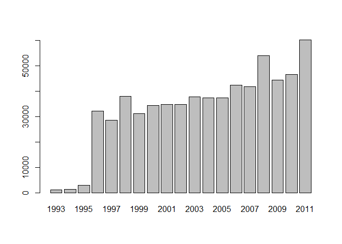
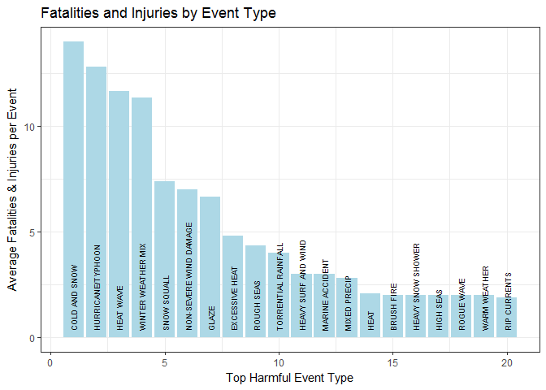
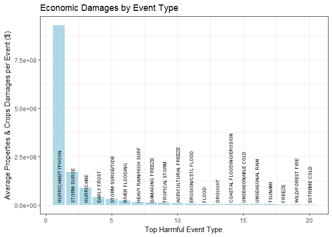

Storm Data Analysis
================

Summary
-------

This is an R Markdown doucment which summarise the analysis of storm data. Focusing just on data of the United States, we discovered that ""Cold and Snow" and "Hurricane/Typhoon" are are the most harmful to population health and economic damanges respectively.

Data Processing
---------------

First of all, we loaded the source data and required R packages:

``` r
library(lubridate)
library(dplyr)
library(ggplot2)
```

``` r
data <- read.csv(".\\StormData.csv.bz2", header = T, stringsAsFactors = F)
dim(data)
```

    ## [1] 902297     37

``` r
sum(complete.cases(data))
```

    ## [1] 0

``` r
str(data)
```

    ## 'data.frame':    902297 obs. of  37 variables:
    ##  $ STATE__   : num  1 1 1 1 1 1 1 1 1 1 ...
    ##  $ BGN_DATE  : chr  "4/18/1950 0:00:00" "4/18/1950 0:00:00" "2/20/1951 0:00:00" "6/8/1951 0:00:00" ...
    ##  $ BGN_TIME  : chr  "0130" "0145" "1600" "0900" ...
    ##  $ TIME_ZONE : chr  "CST" "CST" "CST" "CST" ...
    ##  $ COUNTY    : num  97 3 57 89 43 77 9 123 125 57 ...
    ##  $ COUNTYNAME: chr  "MOBILE" "BALDWIN" "FAYETTE" "MADISON" ...
    ##  $ STATE     : chr  "AL" "AL" "AL" "AL" ...
    ##  $ EVTYPE    : chr  "TORNADO" "TORNADO" "TORNADO" "TORNADO" ...
    ##  $ BGN_RANGE : num  0 0 0 0 0 0 0 0 0 0 ...
    ##  $ BGN_AZI   : chr  "" "" "" "" ...
    ##  $ BGN_LOCATI: chr  "" "" "" "" ...
    ##  $ END_DATE  : chr  "" "" "" "" ...
    ##  $ END_TIME  : chr  "" "" "" "" ...
    ##  $ COUNTY_END: num  0 0 0 0 0 0 0 0 0 0 ...
    ##  $ COUNTYENDN: logi  NA NA NA NA NA NA ...
    ##  $ END_RANGE : num  0 0 0 0 0 0 0 0 0 0 ...
    ##  $ END_AZI   : chr  "" "" "" "" ...
    ##  $ END_LOCATI: chr  "" "" "" "" ...
    ##  $ LENGTH    : num  14 2 0.1 0 0 1.5 1.5 0 3.3 2.3 ...
    ##  $ WIDTH     : num  100 150 123 100 150 177 33 33 100 100 ...
    ##  $ F         : int  3 2 2 2 2 2 2 1 3 3 ...
    ##  $ MAG       : num  0 0 0 0 0 0 0 0 0 0 ...
    ##  $ FATALITIES: num  0 0 0 0 0 0 0 0 1 0 ...
    ##  $ INJURIES  : num  15 0 2 2 2 6 1 0 14 0 ...
    ##  $ PROPDMG   : num  25 2.5 25 2.5 2.5 2.5 2.5 2.5 25 25 ...
    ##  $ PROPDMGEXP: chr  "K" "K" "K" "K" ...
    ##  $ CROPDMG   : num  0 0 0 0 0 0 0 0 0 0 ...
    ##  $ CROPDMGEXP: chr  "" "" "" "" ...
    ##  $ WFO       : chr  "" "" "" "" ...
    ##  $ STATEOFFIC: chr  "" "" "" "" ...
    ##  $ ZONENAMES : chr  "" "" "" "" ...
    ##  $ LATITUDE  : num  3040 3042 3340 3458 3412 ...
    ##  $ LONGITUDE : num  8812 8755 8742 8626 8642 ...
    ##  $ LATITUDE_E: num  3051 0 0 0 0 ...
    ##  $ LONGITUDE_: num  8806 0 0 0 0 ...
    ##  $ REMARKS   : chr  "" "" "" "" ...
    ##  $ REFNUM    : num  1 2 3 4 5 6 7 8 9 10 ...

It appears that none of the record is complete, so we have to be careful about those missing values during our analysis process.

We found that there are more than 50 states identified in the source data. We removed those unrecagolized states and just focus on the events identified and occurred in the United States.

``` r
length(unique(data$STATE))
```

    ## [1] 72

``` r
data <- data[data$STATE %in% state.abb, ]
length(unique(data$STATE))
```

    ## [1] 50

Then we explored the data to see if there is anything else we should cleanse.

If there is either no begin date or no end date of the event, we assume that the data is not complete or not correctly recorded. It shows that all rows have valid begin date but some have end date missing. We removed those missings.

``` r
dim(data)
```

    ## [1] 883186     37

``` r
nrow(data[data$BGN_DATE != "", ])
```

    ## [1] 883186

``` r
data$BGN_DATE <- as.Date(data$BGN_DATE, '%m/%d/%Y')

nrow(data[data$END_DATE != "", ])
```

    ## [1] 640169

``` r
data <- data[data$END_DATE != "", ]
dim(data)
```

    ## [1] 640169     37

``` r
data$END_DATE <- as.Date(data$END_DATE, '%m/%d/%Y')
```

Next, we know that in the earlier years, the records may be not as good as the ones recorded in latter years due to the technology and resources constraints.

``` r
barplot(table(year(data$BGN_DATE)))
```



It shows that events were recorded in a consistant way after year 1996, so we decided to remove data before 1996 to make the data more clear and reliable.

``` r
data <- data[year(data$BGN_DATE) >= 1996, ]
dim(data)
```

    ## [1] 634826     37

Lastly, we found that value of EVTYPE is messy. Upper case and lower case mixes and blank spaces between words are also unpredictable. Therefore we transformed all values to upper case and removed duplicated or unnecessary blank spaces either in leading/trailing or in the middle between words.

``` r
length(unique(data$EVTYPE))
```

    ## [1] 495

``` r
data$EVTYPE <- 
    gsub("\\s+", " ", gsub("^\\s+|\\s+$", "", toupper(data$EVTYPE)))
length(unique(data$EVTYPE))
```

    ## [1] 409

Event type has been reduced from 495 to 409. Note that it is challenging to tell apart some of the types, which are very close in the meanings. So it would be helpful to clear and reclassify the event types. But we will stop here since it will take much more efforts to do so.

PROPDMGEXP and CROPDMGEXP are also important to calculate the total damanges, so let's give it a check.

``` r
unique(data$PROPDMGEXP)
```

    ## [1] "K" ""  "M" "B" "0"

``` r
unique(data$CROPDMGEXP)
```

    ## [1] "K" ""  "M" "B"

They looks fine.

Analysis and Results
--------------------

To answer the question 1: Across the United States, which types of events (as indicated in the EVTYPE variable) are most harmful with respect to population health? We need to add up FATALITIES and INJURIES and compare the average harm to population per event by event type.

``` r
popdmg <- data %>% group_by(EVTYPE) %>% 
    summarise(avg_hurt = mean(FATALITIES + INJURIES)) %>% 
    arrange(desc(avg_hurt))
dim(popdmg)
```

    ## [1] 409   2

Since there are more than 600 types of event, we visulized the topppest 20.

``` r
ggplot(data = popdmg[1:20,], aes(x = 1:20, y = avg_hurt)) +
    geom_bar(stat="identity", fill="light blue") +
    geom_text(aes(label = EVTYPE, angle = 90, y = 0.3, hjust = 0), size = 2.5) +
    labs(x = "Top Harmful Event Type", y = 'Average Fatalities & Injuries per Event') + 
    labs(title = "Fatalities and Injuries by Event Type") +
    theme_bw()
```



It shows that "Cold and Snow" drives the most damanges to population health. The average fatalities plus injuries is around 18. The 2nd one is "Hurricane/Tphoon", which result in 16 on average, and "Heat Wave" comes to the 3rd.

To answer the question 2: Across the United States, which types of events have the greatest economic consequences? We need to add up Properties damage and crops damage and then compare the average damange per event by event type. Before doing that, we defined a function "mult" in order to be able to take the measure scale into our calculation.

``` r
mult <- function(x) {
    y <- case_when(
        x == "K" ~ 1000,
        toupper(x) == "M" ~ 1000000,
        x == "B" ~ 1000000000,
        TRUE ~ 1    
    )
    return(y)
}

ecodmg <- data %>% 
    mutate(pd = PROPDMG * mult(PROPDMGEXP), cd = CROPDMG * mult(CROPDMGEXP)) %>%
    group_by(EVTYPE) %>% 
    summarise(avg_ecodmg = mean(pd + cd)) %>% 
    arrange(desc(avg_ecodmg))
```

Since there are more than 600 types of event, we visulized the topppest 20.

``` r
ggplot(data = ecodmg[1:20,], aes(x = 1:20, y = avg_ecodmg)) +
    geom_bar(stat="identity", fill="light blue") +
    geom_text(aes(label = EVTYPE, angle = 90, y = 1e+07, hjust = 0), size = 2.5) +
    labs(x = "Top Harmful Event Type", y = 'Average Properties & Crops Damages per Event ($)') +
    labs(title = "Economic Damages by Event Type") +
    theme_bw()
```



It shows that "Hurricane/Typhoon" drives the most damanges to properties and crops. The average fatalities plus injuries is around $1B. The 2nd one is "Storem Surge", which result in about 0.2B dollars on average, and "Hurricane" comes to the 3rd.
